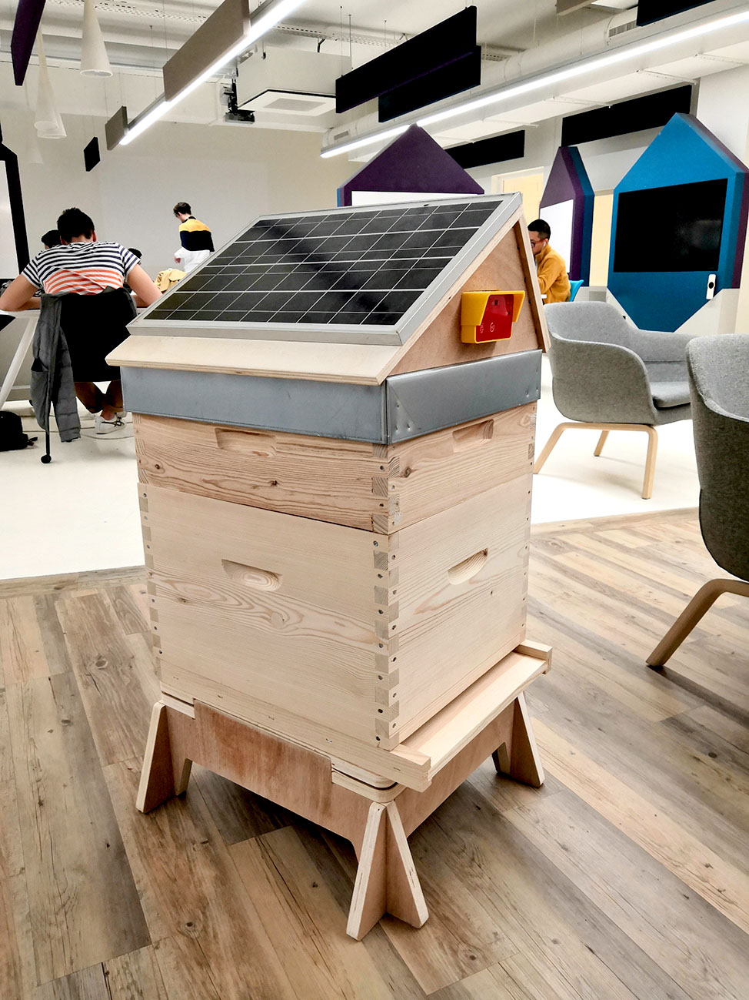
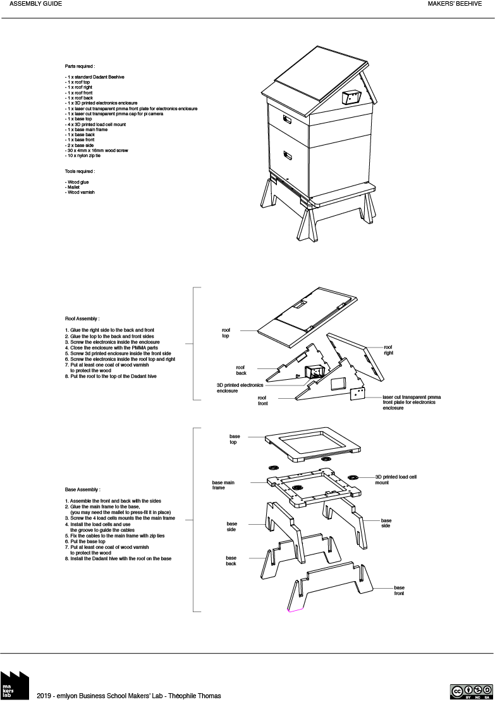

# Makers' Beehive

Makers’ Beehive is an open source beehive that was designed and
crafted at emlyon Business School’s makers’ lab during a bootcamp about IoT
by staff, students and alumni.

This project upgrades a standard dadant type beehive with load sensors on the base,
environmental sensors and camera on the roof.

More info here :[makerslab.em-lyon.com](http://makerslab.em-lyon.com/)

Makers' Beehive is licensed under the [CC by-nc-sa 4.0](https://creativecommons.org/licenses/by-nc-sa/4.0/) creative commons license

---

## Building instructions

### Electronics

Instructions for the electronics part used to monitor the activity of the beehive and the environment can be found on [this github repository](https://github.com/emlyon/makers-beehives-hardware)

---

### CNC milling

Makers Beehive has been designed to be fabricated using a CNC router with CTBX plywood 21mm.

Use a 8mm flat milling bit to cut. The [3D model](CNC router/makers_beehive_CNC.3dm) includes the layout for CNC milling.

We used [Autodesk Fusion 360](https://www.autodesk.com/products/fusion-360/overview) to generate the toolpaths : you can find tutorials about the _Manufacture_ feature of Fusion 360 on [Autodesk website](https://f360ap.autodesk.com/courses#creating-toolpaths-and-programs-cam).

---

### Assembly

A detailled list of the parts and an assembly guide can be found [in this pdf](makers_beehive_assembly_guide.pdf).
